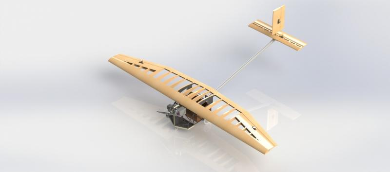

---

## Description

3D modeling and the creation of technical drawings allow for detailed visualization and the optimization of each component prior to physical manufacturing. By utilizing CAD (Computer-Aided Design) software, designers can create precise models of components and all internal systems, simulating assembly, checking for interferences between parts, and obtaining structural parameters.

---

## Files

+ [Technical Drawings](technical_drawing.pdf)

