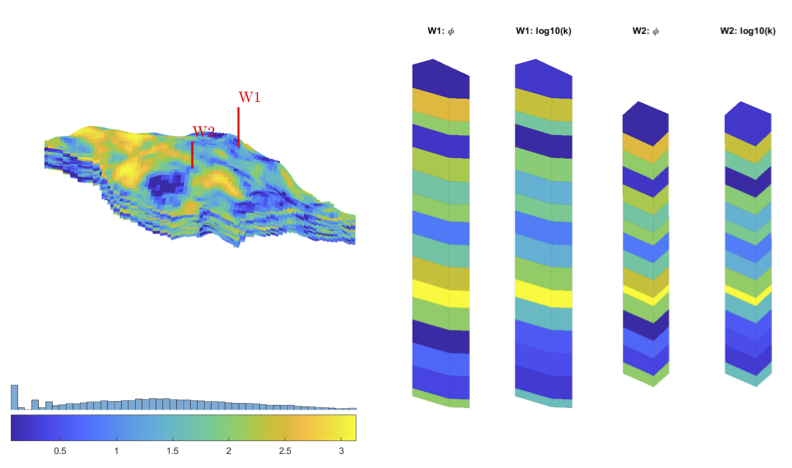

---

## Numerical Modeling of Petroleum Reservoirs

Numerical modeling of petroleum reservoirs is an essential tool in the oil and gas industry, allowing us to simulate a reservoir's behavior over time. The main goal is to predict oil, gas, and water production, optimize development strategies, and manage the field's lifespan. This simulation involves solving complex equations that describe the flow of fluids (oil, gas, and water) through a porous medium (the reservoir rock) under various pressure and temperature conditions.

## Types of Numerical Grids

The numerical grid is the discretization of the reservoir volume into smaller cells, where the flow equations are solved. The choice of grid type directly impacts the simulation's accuracy and computational efficiency. Common types include:

* Cartesian: These are the simplest, formed by rectangular or cubic cells. They're easy to build and suitable for reservoirs with simple geometries and horizontal layers. However, they don't represent complex geometries or faults well.
* Unstructured Grids: These offer great flexibility to adapt to complex geometries, such as faults, channels, and lenses, using cells of various shapes (triangles, tetrahedrons). They are more complex to build and computationally more demanding.
* Corner-Point Grid: This is a structured, yet flexible, grid type widely used in reservoir modeling. Each cell is defined by eight corner points (vertices), allowing the cell faces to be neither necessarily planar nor perpendicular.

The main advantage of the Corner-Point grid is its ability to represent geological faults and dipping layers with greater accuracy than Cartesian grids, while maintaining an organized structure that facilitates cell indexing. This allows the grid to deform to follow the stratigraphy and discontinuities of the reservoir. Although more complex to build than a Cartesian grid, it's significantly less complex than an unstructured grid, making it a good compromise between geometric precision and computational efficiency for most reservoir cases.

---

## Reservoir Characterization

Reservoir characterization is the process of defining the reservoir's geological and petrophysical properties. This involves integrating data from various sources, such as:

* Geology: Analysis of cores, well logs, and seismic data to understand the structure, stratigraphy, sedimentology, and identification of faults and fractures.
* Petrophysics: Measurement and interpretation of rock properties (porosity, permeability, fluid saturation) obtained from well logs and laboratory analyses.
* Production Data: Historical oil, gas, and water production from wells, reservoir pressures, and well tests, which provide dynamic information about the reservoir's behavior.

The accuracy of the characterization is fundamental, as it defines the input parameters for the numerical model. A poorly characterized model will produce unrealistic results.

### Petrophysics

Petrophysics is the study of the physical properties of rocks that influence fluid flow in porous media. The main petrophysical properties for numerical modeling include:

* Porosity ($\phi$): This is the fraction of the total rock volume occupied by pores (void spaces) where fluids can be stored. It's a measure of the reservoir's storage capacity.
* Permeability ($k$): This is the ability of the rock to allow fluids to flow through its interconnected pores. It's a measure of the reservoir's hydraulic conductivity.
* Fluid Saturation ($S_o$, $S_g$, $S_w$): Represents the fraction of the pore volume occupied by each fluid type (oil, gas, water). The sum of saturations must equal 1.
* Compressibility ($c$): Measures the change in rock or fluid volume in response to a pressure change.

### Hydraulic Flow Units

A hydraulic flow unit is a continuous and mappable volume of reservoir rock that shares consistent geological and petrophysical characteristics, sufficiently so to control fluid flow in a similar manner. This means that within a flow unit, porosity and permeability (and their relationships with fluid saturation) are relatively homogeneous, simplifying flow modeling. Identifying and mapping these units is crucial for simplifying the reservoir model and ensuring that petrophysical properties are correctly assigned within the numerical grid.

---

## Flow in Porous Media

Flow in porous media is the study of fluid movement (oil, gas, water) through the network of pores and pore throats of a reservoir rock. This process is governed by physical laws, with Darcy's Law being the basis for describing flow in laminar regimes:

$$ q = - \dfrac{kA}{\mu} \dfrac{dP}{dx}$$
 
Where:

* $q$ is the volumetric flow rate
* $k$ is the permeability of the porous medium
* $A$ is the cross-sectional area
* $\mu$ is the fluid viscosity
* $\frac{dP}{dx}$ is the pressure gradient

Numerical modeling extends Darcy's Law to multiple phases (oil, gas, water) and to heterogeneous and anisotropic media, also considering the effects of gravity and capillarity.

### Black-Oil Model

The Black-Oil model is one of the most common and widely used models for reservoir simulation. It's a simplified compositional model that treats oil and gas as binary mixtures or pseudocomponents. The central premise is that gas can dissolve in oil and oil can evaporate into gas, but there is no mass exchange between the individual components of each phase (e.g., light components of oil don't separate into a pure gas phase, and heavy components of gas don't liquefy into a pure oil phase).

In the Black-Oil model, fluids are typically described by:

* Formation Volume Factor (FVF): Relates the volume of a phase (oil or gas) at the surface to its volume in the reservoir.
* Gas-Oil Ratio (GOR): The amount of gas that separates from the oil under surface conditions.
* Viscosity: The resistance to flow for each phase.
* Bubble Point Pressure / Dew Point Pressure: The pressures at which gas begins to separate from oil or oil begins to condense from gas, respectively.

This model is computationally efficient and suitable for most light oil and dry gas reservoirs. However, for reservoirs with more complex fluids (such as heavy oil, gas condensates, or high-pressure gas injection), more sophisticated compositional models may be necessary.

---

## Related Material

The [MATLAB Reservoir Simulation Toolbox (MRST)](https://www.sintef.no/projectweb/mrst/) is a free open-source software for reservoir modelling and simulation, developed primarily by the Applied Computational Science group in the Department of Mathematics and Cybernetics at SINTEF Digital. 

