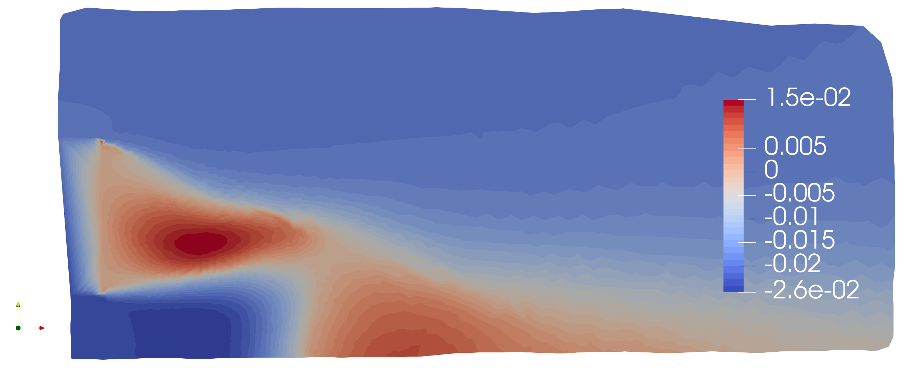

---

# Modal Analysis in Fluid Dynamics

Fluid dynamics, particularly in turbulent regimes, exhibits a high degree of complexity due to nonlinear interactions across spatial and temporal scales. The identification of **coherent structures** in these flows is essential for understanding the underlying physical mechanisms and for developing efficient reduced-order models. Modal analysis provides systematic tools for this decomposition, allowing the extraction of dominant flow patterns.  

## Concept of Coherent Structures

Coherent structures are organized spatial and temporal patterns that emerge in turbulent flows and carry a significant portion of the system's energy and dynamics. Examples include vortices, pressure waves, or periodic oscillation patterns. Identifying them is crucial for understanding momentum transport, energy dissipation, and instabilities in fluid flows.  

## Classical Modal Analysis Techniques

The main techniques for modal decomposition in fluid dynamics include:  

- **Proper Orthogonal Decomposition (POD):** Identifies modes that maximize the mean flow energy, revealing the most energetic and dominant structures.  
- **Dynamic Mode Decomposition (DMD):** Decomposes the flow into dynamic modes associated with specific frequencies and growth rates, enabling the analysis of oscillatory patterns and instabilities.  

These approaches allow for the separation of relevant flow components, facilitating the study of the underlying dynamics and interactions across scales.  

## Applications in Modeling and Simulation

The identification of coherent modes enables the construction of **Reduced-Order Models (ROMs)**, which simplify the simulation of complex systems:  

- Reduce the computational cost of large-scale simulations.  
- Allow parametric analyses and the study of instabilities.  
- Provide support for flow control and fluid system optimization.  

## Concluding Remarks

Modal analysis is a powerful tool to decompose, understand, and model complex flows, providing simplified representations that preserve the essential dynamics of the system. Its application significantly contributes to advances in simulation, prediction, and control in fluid dynamics.

