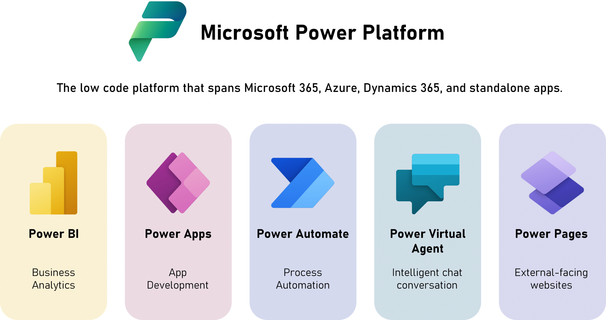

---

## Industrial Management: The Heart of Efficiency

Industrial Management is essential for any manufacturing operation, aiming to optimize all processes, from the acquisition of raw materials to the delivery of the final product. It encompasses the planning, organizing, directing, and controlling of resources (human, material, financial, and technological) to achieve production objectives efficiently and economically. Effective industrial management seeks not only to produce more but to produce better, with less waste and higher quality, which leads us directly to the next point.

---

## Continuous Improvement: The Relentless Pursuit of Excellence

Directly linked to Industrial Management, Continuous Improvement is a philosophy that advocates for the incessant pursuit of optimization at all organizational levels. It's not a one-time action but a continuous cycle of problem identification, solution implementation, results verification, and standardization. Methodologies like Lean Manufacturing, Six Sigma, and Kaizen are pillars of continuous improvement, boosting efficiency, reducing costs, and elevating quality. However, for this improvement to be effective and data-driven, we need a way to measure progress.

---

## Indicator Management: The GPS for Performance

Indicator Management (or KPIs - Key Performance Indicators) is what allows continuous improvement to be guided by facts and data, rather than just intuition. These are quantifiable metrics that reflect the performance of processes, teams, and the organization as a whole. Examples include OEE (Overall Equipment Effectiveness), scrap rate, cycle time, and productivity. By collecting, analyzing, and monitoring these indicators, companies can identify bottlenecks, make strategic decisions, and evaluate the impact of improvement actions. And this is where technology becomes a powerful ally.

---

## Digital Transformation: The Industrial Revolution

Digital Transformation represents the integration of digital technologies into all areas of a business, fundamentally changing how operations are performed and how value is delivered to customers. In industrial management, this manifests in process automation, the use of artificial intelligence for optimization, the implementation of real-time data systems, and the connectivity of machines (IoT - Internet of Things). Digital transformation isn't just about using new tools; it's about a mindset shift that aims to enhance efficiency, agility, and innovation capability, and for this, platforms emerge that democratize access to solution creation.

---

## Low-Code Tools (Microsoft Power Platform): Accelerating Innovation

Low-code tools, such as the Microsoft Power Platform (which includes Power Apps, Power Automate, and Power BI), are a key driver of digital transformation. They enable users with little to no programming knowledge to create custom applications, automate workflows, and analyze data. This dramatically accelerates the development of internal solutions, allowing operational and management teams to build tailored tools to optimize processes, manage indicators, and support continuous improvement, without having to rely solely on specialized developers. It's the democratization of value creation, connecting all the pieces of this Industry 4.0 puzzle.

