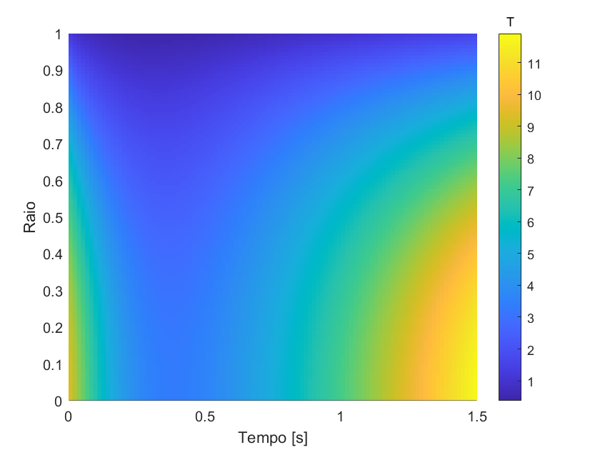

---

## Differential Equations in Physics: The Language of the Universe

Differential Equations (DEs) are the backbone of modern physics. They describe how quantities change and relate to each other, allowing us to model and predict the behavior of physical systems over time or space. From the motion of a planet to the propagation of heat in a material, DEs capture the dynamic essence of natural phenomena. Without them, our understanding of the universe would be drastically limited.

---

## Transport Phenomena: The Dynamics of Matter and Energy

Transport Phenomena study the transfer of momentum, energy, and mass within a system. They are governed by differential equations and are crucial in various areas of engineering and physics.

**Fluid Dynamics:** Focuses on the movement of liquids and gases, and the forces acting upon them. The famous Navier-Stokes Equations are a complex set of partial differential equations that describe fluid flow. They are essential for aircraft design, piping systems, and even understanding weather.

**Heat Transfer:** Deals with the propagation of thermal energy. Heat Conduction Equations, like Fourier's equation, are partial differential equations that describe how temperature changes in a material due to conduction, convection, and radiation. This is vital for the design of heat exchangers, thermal insulation, and electronics.

The complexity of these equations often necessitates sophisticated approaches for their solution.

---

## Solving Differential Equations: Unraveling the Mysteries

Finding the solution to differential equations means determining the function (or functions) that satisfy the equation. Depending on the complexity and type of DE, we can employ different approaches.

### Analytical Methods: The Quest for Exact Solutions

Analytical Methods aim to find an exact solution (in the form of a mathematical function) for the differential equation. They are powerful when applicable, providing a complete understanding of the system's behavior.

* **Separation of Variables:** Used to solve DEs where variables can be isolated on opposite sides of the equation.
* **Integrating Factor:** Applies to certain first-order linear DEs.
* **Power Series:** Used to solve DEs that don't have simple solutions, expressing the solution as an infinite series.
* **Laplace Transform:** Converts a DE into an algebraic equation in the frequency domain, which is easier to solve, and then inverts the transform to get the solution in the time domain.
* **Method of Variation of Parameters:** Used to find particular solutions for non-homogeneous linear DEs.
* **Eigenvalues and Eigenvectors (for systems of DEs):** Crucial for solving systems of linear differential equations.

Unfortunately, most DEs arising from real-world problems are so complex that they don't have analytical solutions. That's where numerical methods come in.

### Numerical Methods: The Art of Approximation

Numerical Methods are computational techniques that provide approximate solutions to differential equations by transforming them into algebraic problems that can be solved by computers. They are indispensable for complex equations or those with irregular boundary conditions.

* **Euler's Method:** The simplest numerical method, which uses the slope at one point to estimate the next.
* **Runge-Kutta Methods (RK4 is the most common):** A family of more accurate methods than Euler's, which use multiple slope evaluations within an interval.
* **Finite Difference Method (FDM):** Approximates derivatives in a DE by finite differences, transforming the DE into a system of algebraic equations. Widely used in fluid dynamics and heat transfer.
* **Finite Element Method (FEM):** Divides the problem domain into small "elements" and approximates the solution within each element. Extremely versatile for complex geometries and varied boundary conditions.
* **Finite Volume Method (FVM):** Based on the conservation of properties within discrete control volumes. Popular in computational fluid dynamics (CFD).
* **Method of Lines (MOL):** A technique that transforms a partial differential equation (PDE) into a system of ordinary differential equations (ODEs) by discretizing one or more spatial variables while keeping other variables (usually time) continuous. The resulting ODEs are then solved using numerical methods for ODEs, such as Runge-Kutta. It is particularly useful for propagation problems and for parabolic and hyperbolic PDEs.

### Hybrid Methods: Combining the Best of Both Worlds

Hybrid Methods combine elements from different approaches (analytical and/or numerical) to solve complex problems, leveraging the strengths of each technique.

* **Analytical-Numerical Methods:** Parts of a problem are solved analytically, and the more complex parts (or those with irregular geometry) are handled numerically. For example, finding an analytical solution for one part of an equation and using a numerical method for the remainder.
* **Optimization Combined with Numerical Simulation:** Utilizes optimization algorithms (which can have analytical or heuristic bases) to adjust parameters of complex numerical models, seeking the best solution for a problem.
* **Hybrid Network Modeling:** Combines simplified analytical models for certain components of a system with detailed numerical simulations for other, more complex components.

These tools, both mathematical and computational, are essential for engineers and scientists to model, understand, and design complex systems across various disciplines.

--- 

## Downloads

+ [Final Course Monograph](monograph.pdf)

